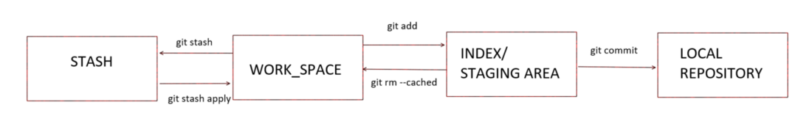

# About stashing and staging

A usual workflow with Git is *working on a file* -> *add the edited file* -> *commit changes* -> *push to remote*. In terms of git commands this would look as follows:

```
touch newfile.txt
git add newfile.txt
git commit -m 'added new file'
git push
```

The `git add` command adds changes in the working directory to the **staging area**. This area contains all changes I definitely want to keep and publish.

Now a typical scenario at work could be, your working on a project but an urgent bug has to be fixed first. You don't want to loose your progress but the current changes are not ready to be published or some changes are missing for a commit. In this case the current changes can be pushed to the **stash**. The stashing command moves all currently staged changes to the local stash and removes the changes. The working area is clean and you can work on the bug fix. Afterwards you can get the previously stashed changes from the stash and continue working.

```
git stash save "WIP: stash for urgent bug fix"
... // work on bug fix
git stash list
git stash pop
```

While `git stash pop` applies the stashed changes to the working area and removes it from the stash, it is also possible to just `git stash apply` it and later `git stash drop` it.

With `git stash save -u "Some name"` all changed files will be stashed whether staged (tracked) or not (un-tracked).



-------------------------------------------
*[back to the main page](../readme.md)*
